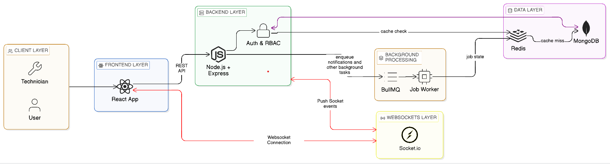

<div align="center">

# TechEz


</div>

---

## Overview

TechEz is a full-stack technician marketplace platform built on a  monolith architecture using React, Node.js, and TypeScript.

It enables users to discover technicians, create service bookings, place bids, and track service progress in real time. Technicians can manage profiles, handle service requests, and update job statuses efficiently.

The platform supports real-time communication via Socket.IO, Redis-based caching for performance optimization, and BullMQ-powered background job processing for scalable asynchronous workflows.

---

## Features

### 👤 User Features
- Authentication (register, login, password reset)
- Browse verified technicians by category
- Create and manage bookings
- Place bids on service requests
- Reviews and reporting system

### 🔧 Technician Features
- Verified onboarding workflow
- Profile management
- Booking handling and status updates
- View reviews and feedback

### ⚙️ Platform Features
- Role-based access control (User / Technician)
- REST API architecture (Controller → Service → Model)
- Real-time updates with Socket.IO
- Background job processing using Redis + BullMQ
- MongoDB with caching support

---

## System Architecture

Architecture diagram: [architecture.png](./architecture.png)



---

## 🛠️ Tech Stack

### Frontend
- React
- TypeScript
- Redux Toolkit
- React Query
- Tailwind CSS
- Socket.IO Client

### Backend
- Node.js
- Express.js
- TypeScript
- Socket.IO
- BullMQ
- Zod (validation)
- Winston (logging)

### Database & Infrastructure
- MongoDB (Mongoose)
- Redis (caching)
- Cloudinary (media storage)
- Nodemailer (email service)

---

## ⚙️ Core Capabilities

- Real-time communication using WebSockets (Socket.IO)
- Asynchronous background job processing (BullMQ)
- Role-based system architecture (User / Technician)
- Caching layer using Redis for performance optimization
- Scalable REST API design
- Monolith architecture for maintainability and simplicity

---

## 📁 Project Structure


```

TechEz/
├── client/
│   └── src/
│       ├── assets/
│       ├── components/
│       ├── features/
│       ├── hooks/
│       ├── lib/
│       ├── pages/
│       ├── routes/
│       ├── services/
│       ├── store/
│       ├── types/
│       ├── utils/
│       ├── App.tsx
│       ├── main.tsx
│       └── index.css
│
├── server/
│   └── src/
│       ├── config/
│       ├── controllers/
│       ├── services/
│       ├── models/
│       ├── routes/
│       ├── middlewares/
│       ├── validators/
│       ├── jobs/
│       ├── utils/
│       ├── types/
│       ├── app.ts
│       └── index.ts
│
├── architecture.png
├── api.md
├── .gitignore
└── README.md
```

---

## Getting Started

### Backend

```
cd server
```

```
npm install
```

```
npm run dev
```

### Frontend

```
cd client
```

```
npm install
```

```
npm run dev
```

---

## API Documentation

See [api.md](./api.md) for the full API reference.

---

## Author

Saurav Pant  
Portfolio: https://sauravpant.com.np  
GitHub: https://github.com/Sauravpant

---

## License

This project is licensed under the MIT License. See [LICENSE](./LICENSE).
